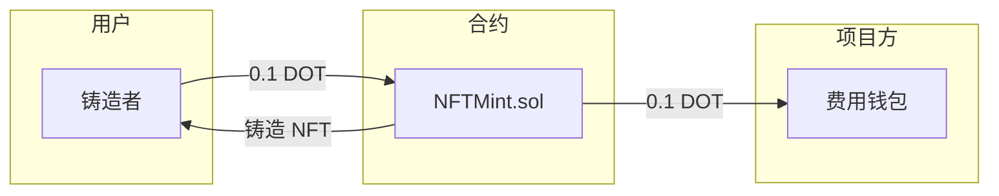

# NFT 铸造抽成方案设计

> 日期：2026-01-17  
> 状态：待审核

## 概述

本设计为 Murmur Protocol 引入项目方盈利机制，通过在 NFT 铸造时收取固定费用实现。

### 核心设计决策

| 决策项           | 选择                     |
| ---------------- | ------------------------ |
| **主要收费环节** | NFT 铸造时               |
| **收费模式**     | 固定费用                 |
| **收费金额**     | 0.1 DOT (0.1 × 10¹⁸ wei) |
| **付费方**       | NFT 铸造者               |
| **辅助收费**     | 无                       |

---

## 用户确认事项

> [!IMPORTANT]
> 请确认以下设计是否符合预期

1. **铸造者激励问题**：铸造者独自支付 0.1 DOT，可能导致"等别人铸造"心理。是否需要添加首个铸造者奖励机制？
2. **费用收取地址**：需要指定一个项目方钱包地址接收费用
3. **费用币种**：确认使用 vDOT（已质押的）还是原生 DOT

---

## 技术实现方案

### 合约修改

#### [MODIFY] [NFTMint.sol](file:///Users/jackliu/Documents/murmur-protocol/murmur-protocol/contracts/contracts/modules/nft/NFTMint.sol)

**新增状态变量**：

```solidity
uint256 public constant MINT_FEE = 0.1 ether; // 0.1 DOT
address public feeRecipient; // 费用接收地址
```

**修改 `mintWithSignature` 函数**：

```diff
function mintWithSignature(
    uint256 topicId,
    bytes32 ipfsHash,
    uint256 nonce,
    bytes calldata signature
- ) external returns (uint256 tokenId) {
+ ) external payable returns (uint256 tokenId) {
+   require(msg.value >= MINT_FEE, "NFT: insufficient fee");

    // ... existing logic ...

+   // Transfer fee to recipient
+   (bool success, ) = feeRecipient.call{value: MINT_FEE}("");
+   require(success, "NFT: fee transfer failed");
+
+   // Refund excess
+   if (msg.value > MINT_FEE) {
+       (success, ) = msg.sender.call{value: msg.value - MINT_FEE}("");
+       require(success, "NFT: refund failed");
+   }
}
```

#### [MODIFY] [LibNFTStorage.sol](file:///Users/jackliu/Documents/murmur-protocol/murmur-protocol/contracts/contracts/libraries/LibNFTStorage.sol)

**新增存储字段**：

```solidity
address feeRecipient;  // 费用接收地址
```

---

## 资金流向图



---

## 收入预估

| 场景     | 议题数/月 | 月收入 (DOT) |
| -------- | --------- | ------------ |
| 冷启动期 | 100       | 10 DOT       |
| 活跃期   | 1,000     | 100 DOT      |
| 繁荣期   | 10,000    | 1,000 DOT    |

---

## 验证计划

### 单元测试

```bash
cd /Users/jackliu/Documents/murmur-protocol/murmur-protocol/contracts
npx hardhat test --grep "mint fee"
```

需新增测试用例：

- `should require MINT_FEE payment`
- `should transfer fee to feeRecipient`
- `should refund excess payment`
- `should fail if fee insufficient`

### 手动验证

1. 部署合约到测试网
2. 设置 `feeRecipient` 为项目方测试钱包
3. 调用 `mintWithSignature` 并发送 0.1 DOT
4. 确认 NFT 铸造成功且费用到账

---

## 可选优化（未来考虑）

- [ ] 动态费用（根据市场情况调整）
- [ ] 首个铸造者奖励（激励快速铸造）
- [ ] 费用分成（部分回馈社区）
