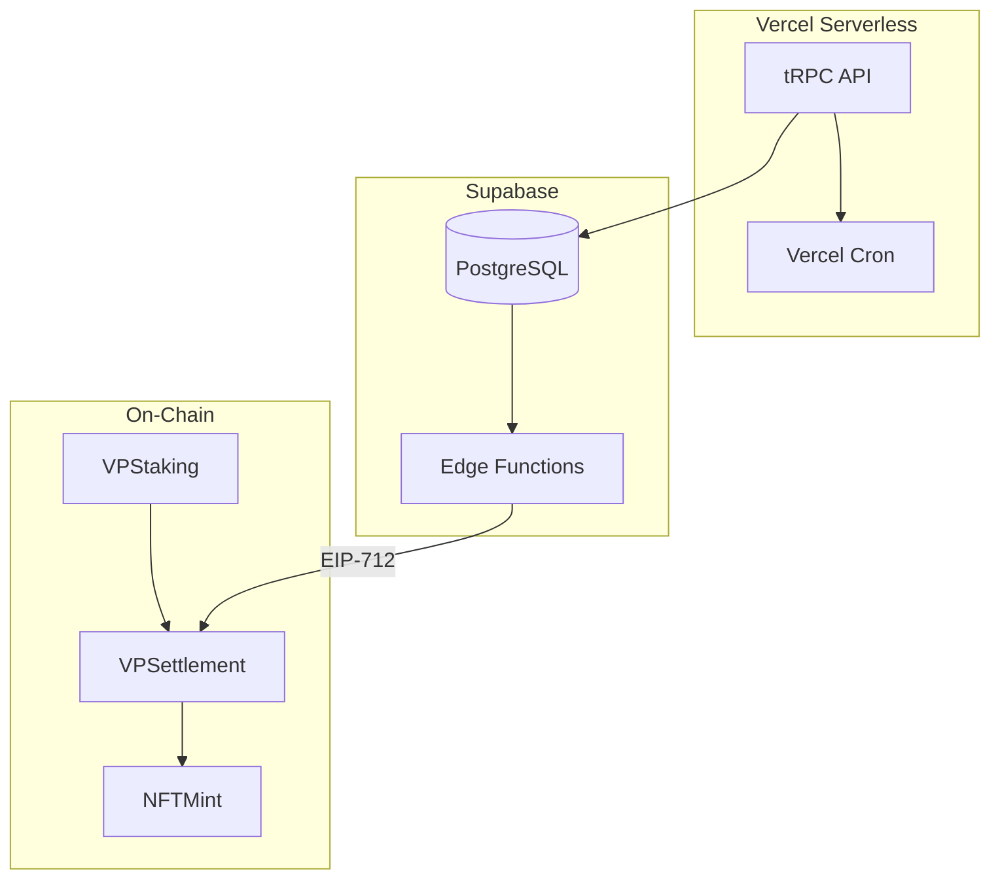

# Murmur Protocol 后端配置设计文档

> **设计决策**: VP 混合同步 | MVP 固定 AI 评分 | 混合触发结算 | Vercel + Supabase
>
> **日期**: 2026-01-18

---

## 1. 架构概览



---

## 2. 环境变量

```env
# Database
DATABASE_URL="postgresql://..."
SUPABASE_SERVICE_ROLE_KEY="..."

# Chain
NEXT_PUBLIC_CHAIN_ID="1284"
NEXT_PUBLIC_ROUTER_PROXY="0x..."

# Settlement
SETTLEMENT_INTERVAL_HOURS="4"
SETTLEMENT_THRESHOLD_VP="10000000000000000000000"

# MVP
AI_FIXED_SCORE="0.5"
```

---

## 3. 核心服务

### 3.1 VP 混合同步

- 缓存链上余额到数据库
- 5 分钟过期后重新查询链上
- 操作前验证余额充足

### 3.2 结算 Cron Job

- Vercel Cron 每 4 小时触发
- 门槛: 10,000 VP 或 5+ 用户
- 调用 Supabase Edge Function 生成签名

### 3.3 EIP-712 签名

- 私钥存储在 Supabase Vault
- Edge Function 隔离签名逻辑

---

## 4. 安全

- Supabase RLS 限制用户只能查看自己的消费
- API 验证钱包签名
- 生产环境禁用直接私钥配置

---

## 5. 部署检查清单

- [ ] 配置 Vercel 环境变量
- [ ] Supabase Vault 存储私钥
- [ ] 启用 RLS 策略
- [ ] 配置 `vercel.json` Cron
